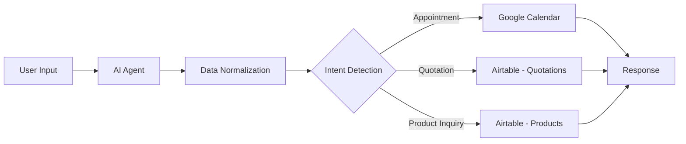

# AI Appointment and Quotation Automation 

## Overview

This project is an AI-powered automation system built with n8n that manages customer interactions, appointment scheduling, and quotation generation. It integrates natural language processing with workflow automation to create a scalable solution for lead management and sales operations.

The system processes user input, determines intent, and executes actions such as creating calendar events or generating structured records in Airtable.

---

## Features

### AI Agent

* Interprets natural language inputs
* Detects user intent (appointments, product inquiries, quotations)
* Outputs structured data for downstream processing

### Google Calendar Integration

* Creates, updates, and cancels events
* Uses ISO 8601 date format
* Ensures consistent timezone handling
* Supports automated scheduling workflows

### Airtable Integration

* Stores customer, conversation, and quotation data
* Maintains structured product catalog
* Enables automated record creation and updates

### Product Matching

* Matches user queries to products using keyword-based logic
* Enhances AI responses with structured product data

---

## Architecture



---

## Tech Stack

* n8n (workflow automation)
* OpenAI / AI Agent (natural language processing)
* Airtable (database and CRM)
* Google Calendar API (scheduling)

---

## Data Flow

1. User submits a message
2. AI agent extracts intent and structured fields
3. Data is normalized and validated
4. Workflow routes execution based on intent:

   * Appointment → Google Calendar
   * Quotation → Airtable
   * Product query → Airtable lookup
5. System returns a response to the user

---

## Date Handling

The system uses ISO 8601 format for all date-time operations:

```
YYYY-MM-DDTHH:mm:ss-06:00
```

The AI receives the current date dynamically to correctly interpret relative inputs such as:

* "tomorrow"
* "next week"
* "in the afternoon"

Example:

```javascript
{{ DateTime.now().setZone('America/Monterrey').toFormat('yyyy-MM-dd') }}
```

All date values are normalized before being sent to external services.

---

## Airtable Schema

### Products

* name
* category
* price
* keywords
* description

### Quotations

* customer
* product
* quantity
* total
* status
* origin

### Conversations

* message
* intent
* timestamp
* requires_human

---

## Validation Strategy

To ensure reliability, the system implements a validation layer between the AI and external services:

* Normalizes date formats
* Enforces valid select field values
* Cleans unexpected AI-generated fields
* Ensures compatibility with APIs

---

## Setup

1. Configure n8n environment
2. Connect OpenAI credentials
3. Connect Airtable API
4. Connect Google Calendar account
5. Import workflow JSON into n8n
6. Configure required environment variables

---

## Testing

Test the system with sample inputs:

* "Schedule a meeting tomorrow at 10am"
* "I want to buy white sneakers"
* "Can you send me a quote?"

Verify:

* Event creation in Google Calendar
* Record creation in Airtable
* Correct AI response output

---

## Known Considerations

* AI-generated fields must be validated before execution
* Timezone consistency is required across all nodes
* Airtable select fields must match predefined values exactly

---

## Future Improvements

* Availability checking before scheduling
* Conflict detection and resolution
* Multi-timezone support
* Payment integration
* Lead scoring and prioritization

---

## License

MIT License
